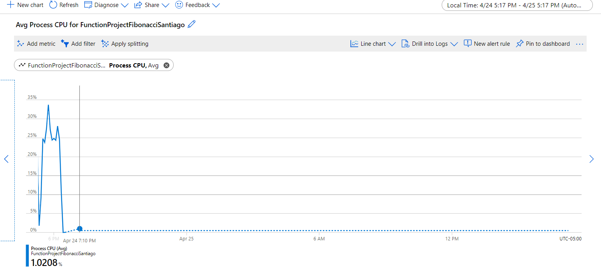

### Escuela Colombiana de Ingeniería
### Arquitecturas de Software - ARSW

## Escalamiento en Azure con Maquinas Virtuales, Sacale Sets y Service Plans

### Dependencias
* Cree una cuenta gratuita dentro de Azure. Para hacerlo puede guiarse de esta [documentación](https://azure.microsoft.com/en-us/free/search/?&ef_id=Cj0KCQiA2ITuBRDkARIsAMK9Q7MuvuTqIfK15LWfaM7bLL_QsBbC5XhJJezUbcfx-qAnfPjH568chTMaAkAsEALw_wcB:G:s&OCID=AID2000068_SEM_alOkB9ZE&MarinID=alOkB9ZE_368060503322_%2Bazure_b_c__79187603991_kwd-23159435208&lnkd=Google_Azure_Brand&dclid=CjgKEAiA2ITuBRDchty8lqPlzS4SJAC3x4k1mAxU7XNhWdOSESfffUnMNjLWcAIuikQnj3C4U8xRG_D_BwE). Al hacerlo usted contará con $200 USD para gastar durante 1 mes.

### Parte 0 - Entendiendo el escenario de calidad

Adjunto a este laboratorio usted podrá encontrar una aplicación totalmente desarrollada que tiene como objetivo calcular el enésimo valor de la secuencia de Fibonnaci.

**Escalabilidad**
Cuando un conjunto de usuarios consulta un enésimo número (superior a 1000000) de la secuencia de Fibonacci de forma concurrente y el sistema se encuentra bajo condiciones normales de operación, todas las peticiones deben ser respondidas y el consumo de CPU del sistema no puede superar el 70%.

### Escalabilidad Serverless (Functions)

1. Cree una Function App tal cual como se muestra en las  imagenes.


2. Instale la extensión de **Azure Functions** para Visual Studio Code.


3. Despliegue la Function de Fibonacci a Azure usando Visual Studio Code. La primera vez que lo haga se le va a pedir autenticarse, siga las instrucciones.


4. Dirijase al portal de Azure y pruebe la function.


5. Modifique la coleción de POSTMAN con NEWMAN de tal forma que pueda enviar 10 peticiones concurrentes. Verifique los resultados y presente un informe.

Primeramente se realizo una prueba con el siguiente comando para poder verificar el funcionamiento correcto:


````
newman run ARSW_LOAD-BALANCING_AZURE.postman_collection.json -e [ARSW_LOAD-BALANCING_AZURE].postman_environment.json -n 10 &
````

Obteniendo como resultado lo siguiente:


Posteriormente se realizo la prueba con este comando anterior pero 10 veces utilizando claro esta **Newman** y la adicion **&** para encadenar las 10 solicitudes , los resultados obtenidos se muestran el la seccion del *informe*

````
newman run ARSW_LOAD-BALANCING_AZURE.postman_collection.json -e [ARSW_LOAD-BALANCING_AZURE].postman_environment.json -n 10 &
newman run ARSW_LOAD-BALANCING_AZURE.postman_collection.json -e [ARSW_LOAD-BALANCING_AZURE].postman_environment.json -n 10 &
newman run ARSW_LOAD-BALANCING_AZURE.postman_collection.json -e [ARSW_LOAD-BALANCING_AZURE].postman_environment.json -n 10 &
newman run ARSW_LOAD-BALANCING_AZURE.postman_collection.json -e [ARSW_LOAD-BALANCING_AZURE].postman_environment.json -n 10 &
newman run ARSW_LOAD-BALANCING_AZURE.postman_collection.json -e [ARSW_LOAD-BALANCING_AZURE].postman_environment.json -n 10 &
newman run ARSW_LOAD-BALANCING_AZURE.postman_collection.json -e [ARSW_LOAD-BALANCING_AZURE].postman_environment.json -n 10 &
newman run ARSW_LOAD-BALANCING_AZURE.postman_collection.json -e [ARSW_LOAD-BALANCING_AZURE].postman_environment.json -n 10 &
newman run ARSW_LOAD-BALANCING_AZURE.postman_collection.json -e [ARSW_LOAD-BALANCING_AZURE].postman_environment.json -n 10 &
newman run ARSW_LOAD-BALANCING_AZURE.postman_collection.json -e [ARSW_LOAD-BALANCING_AZURE].postman_environment.json -n 10 &
newman run ARSW_LOAD-BALANCING_AZURE.postman_collection.json -e [ARSW_LOAD-BALANCING_AZURE].postman_environment.json -n 10 
````

6. Cree una nueva Function que resuleva el problema de Fibonacci pero esta vez utilice un enfoque recursivo con memoization. Pruebe la función varias veces, después no haga nada por al menos 5 minutos. Pruebe la función de nuevo con los valores anteriores. ¿Cuál es el comportamiento?.

La clase *idex.js* se modifico de forma que funcionara con un enfoque recursivo como fue solicitado, ademas de agregarle la memorizacion quedando de la siguiente manera:

````
var bigInt = require("big-integer");
var memorizacion = {};
module.exports = async function (context, req) {
    context.log('JavaScript HTTP trigger function processed a request.');
	
	memorizacion[0] = bigInt.zero;
    memorizacion[1] = bigInt.one;
    let nth = req.body.nth
    let nth_1 = bigInt.one;
    let nth_2 = bigInt.zero;
    let answer = bigInt.zero;
	
	function fibonacci(n) {
		var a = bigInt.zero
        var b = bigInt.zero
        n = Math.abs(n);
		if(memorizacion[n] !== undefined)
			return memorizacion[n];
		else{
           a=fibonacci(n-1)
           b =fibonacci(n-2)
           memorizacion[n] = a.add(b)
           return memorizacion[n];
        }
	}
    answer = fibonacci(nth);

    context.res = {
        body: answer.toString()
    };
}
````


**Preguntas**

* ¿Qué es un Azure Function?

Azure Function es una solución basada en la nube para ejecutar rápidamente pequeños fragmentos de código o "funciones", toma los conceptos fundamentales de los conocidos WebJobs y los amplia de una manera interesante; para poder ejecutar Azure Function, introduce una gran cantidad de nuevos triggers en los que es posible encontrar Cosmos DB, Event Hub y WebHooks.
Es un servicio de Azure serverless que le permite ejecutar código como un servicio. Esto significa que solo debe preocuparse por desarrollar la funcionalidad que necesita, no por la aplicación o la infraestructura que necesita para ejecutarla. Se pueden implementar en una variedad de lenguajes (JavaScript, C #, Python, PHP, etc.), así como en scripting como Bash, Batch y PowerShel. Cuenta con la posibilidad de integrarse con Azure DevOps para procesos de integracion continua.

* ¿Qué es serverless?

Serverless es un tipo de arquitectura que no desarrolla sobre servidores, en la que la responsabilidad de ejecutar un fragmento de código se delega a un proveedor en la nube, quien se encarga de realizar una asignación dinámica de recursos, es decir, escalar los recursos en función de la demanda y liberarlos cuando no se necesitan.
El código generalmente se ejecuta en contenedores stateless que pueden habilitarse mediante una variedad de eventos que van desde solicitudes HTTP hasta eventos de Azure Pipelines, así como sus homólogos en otros proveedores como Amazon AWS Lambda y Google Cloud Functions.

* ¿Qué es el runtime y que implica seleccionarlo al momento de crear el Function App?

El runtime es el intervalo de tiempo en el que un programa en permanece en ejecucion. El Azure corresponde a la versión de lenguaje de la función ejecutable. En este laboratorio, se utilizo el plan **Consumption** y la versión del tiempo de ejecución **12 LTS** , lo que significa que el tiempo de espera será de **5 minutos** y la memoria se limpiará una vez trasncurrido dicho intervalo de tiempo.

* ¿Por qué es necesario crear un Storage Account de la mano de un Function App?

El Storage Account nos brinda un espacio de nombres unicos para usar al almacenar todos los datos de Azure y acceder a estos a través de HTTP, para las diferentes operaciones de almacenamiento y administracion que realizan las Function App, como lo son el manejo de los triggers y logs.

* ¿Cuáles son los tipos de planes para un Function App?, ¿En qué se diferencias?, mencione ventajas y desventajas de cada uno de ellos.

**Consumption plan**
Ofrece escalabilidad dinámica y factura solo cuando la aplicación es ejecutada, tiene un timeout es de 5 minutos y brinda una memoria máxima de 1.5 GB por instancia, un almacenamiento de 1 GB y un máximo número de instancias de 200; las instancias del host de Azure Functions se agregan y quitan dinámicamente según la cantidad de eventos entrantes.

+ Paga solo cuando sus funciones se estén ejecutando
+ Escala automáticamente, incluso durante períodos de alta carga

**Premium plan**
Ofrece escalabilidad dinámica, se factura por el número en segundos de core y la memoria usada en las distintas instancias, puede tener timeouts ilimitados, memoria por instancia de 3.5 GB y un almacenamiento de hasta 250 GB, finalmente ofrece un máximo de 100 instancias.

+ Instancias perpetuamente calientes para evitar cualquier arranque en frío
+ Conectividad de red virtual
+ Duración de ejecución ilimitada (60 minutos garantizados)
+ Tamaños de instancia premium (instancias de un núcleo, dos núcleos y cuatro núcleos)
+ Precios más predecibles
+ Asignación de aplicaciones de alta densidad para planes con aplicaciones de múltiples funciones

**Dedicated plan**
El cliente puede implementar manualmente la escalabilidad, puede tener timeouts ilimitados, memoría por instancia de 1.7 GB y una capacidad de almacenamiento hasta de 1000 GB y el numero de instancias es máximo 20. En este plan se paga lo mismo que por otros recursos de App Service, como las aplicaciones web.

+ Tiene máquinas virtuales infrautilizadas existentes que ya están ejecutando otras instancias de App Service.
+ Desea proporcionar una imagen personalizada en la que ejecutar sus funciones.


* ¿Por qué la memoization falla o no funciona de forma correcta?

Debido a que el plan Consumption utilizado para la Azure Function creada solo proporciona 1.5 GB por instancia, esto es insuficiente cuando se realizan solicitudes de grandes cantidades, lo que hace que la pila se llene. 

* ¿Cómo funciona el sistema de facturación de las Function App?

Las facturas de Azure Functions se basan en el consumo de recursos y las ejecuciones por segundo. Los precios del plan de consumo incluyen 1 millón de solicitudes y 400.000 GB de consumo gratuito de recursos al mes; después de eso, la facturación se basa en el consumo de recursos medido en GB. El consumo de recursos se calcula multiplicando el tamaño medio de la memoria en GB por el tiempo en milisegundos que se tarda en completar la tarea. La cantidad de memoria utilizada por una función se mide pasando de 128 MB a un máximo de 1.536 MB, y el tiempo de ejecución se mide pasando de 1 ms a 1 ms. El tiempo mínimo de ejecución para una sola función es de 100 milisegundos y la memoria mínima es de 128 megabytes.

* Informe

Primeramente se realizo una prueba con el siguiente comando para poder verificar el funcionamiento correcto:


````
newman run ARSW_LOAD-BALANCING_AZURE.postman_collection.json -e [ARSW_LOAD-BALANCING_AZURE].postman_environment.json -n 10 &
````

Obteniendo como resultado lo siguiente:


Posteriormente se realizo la prueba con este comando anterior pero 10 veces utilizando claro esta **Newman** y la adicion **&** para encadenar las 10 solicitudes , los resultados obtenidos se muestran el la seccion del *informe*

````
newman run ARSW_LOAD-BALANCING_AZURE.postman_collection.json -e [ARSW_LOAD-BALANCING_AZURE].postman_environment.json -n 10 &
newman run ARSW_LOAD-BALANCING_AZURE.postman_collection.json -e [ARSW_LOAD-BALANCING_AZURE].postman_environment.json -n 10 &
newman run ARSW_LOAD-BALANCING_AZURE.postman_collection.json -e [ARSW_LOAD-BALANCING_AZURE].postman_environment.json -n 10 &
newman run ARSW_LOAD-BALANCING_AZURE.postman_collection.json -e [ARSW_LOAD-BALANCING_AZURE].postman_environment.json -n 10 &
newman run ARSW_LOAD-BALANCING_AZURE.postman_collection.json -e [ARSW_LOAD-BALANCING_AZURE].postman_environment.json -n 10 &
newman run ARSW_LOAD-BALANCING_AZURE.postman_collection.json -e [ARSW_LOAD-BALANCING_AZURE].postman_environment.json -n 10 &
newman run ARSW_LOAD-BALANCING_AZURE.postman_collection.json -e [ARSW_LOAD-BALANCING_AZURE].postman_environment.json -n 10 &
newman run ARSW_LOAD-BALANCING_AZURE.postman_collection.json -e [ARSW_LOAD-BALANCING_AZURE].postman_environment.json -n 10 &
newman run ARSW_LOAD-BALANCING_AZURE.postman_collection.json -e [ARSW_LOAD-BALANCING_AZURE].postman_environment.json -n 10 &
newman run ARSW_LOAD-BALANCING_AZURE.postman_collection.json -e [ARSW_LOAD-BALANCING_AZURE].postman_environment.json -n 10 
````





